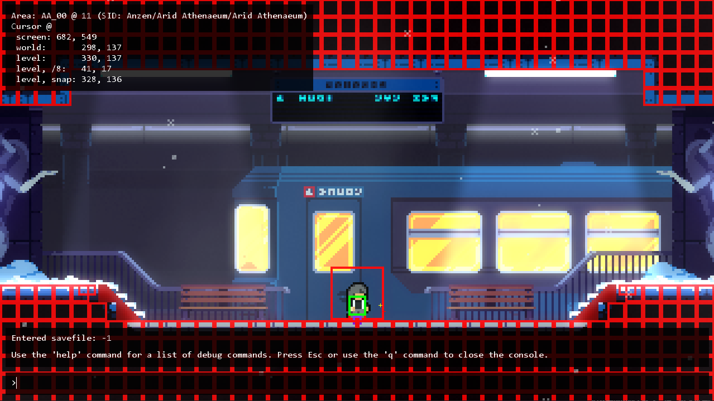

# 安装 Loenn

## 介绍

Lönn（或者写作 Loenn） 是目前主要的蔚蓝制图软件，它是一个几年前主要的制图软件 Ahorn 的替代，不过目前 Ahorn 已停止更新，所以我们只需要关注 Loenn。  
Loenn 开源在 [GitHub](https://github.com/CelestialCartographers/Loenn) 上，所以你可以选择前往 [GitHub Releases](https://github.com/CelestialCartographers/Loenn/releases) ~~忍受极慢的速度~~&#8203;下载，或者，前往制图群的群文件中下载，它位于 “制图工具 本体(Loenn及Ahorn)” 文件夹中。
<!-- 删除线左右都要加空格或者不加, 这里似乎只能这么解决了...? -->
-----

Loenn 支持三大桌面系统，所以一般你下载它时会遇到三种后缀的压缩包：

- `Loenn-v1.0.3-windows.zip`
- `Loenn-v1.0.3-macos.app.zip`
- `Loenn-v1.0.3-linux.zip`

一般大概率你都在 `Windows` 平台上，此时你需要下载 `windows` 结尾的压缩包。  
下载完毕后，解压压缩包，然后将整个文件夹放到一个你能找到的地方，然后双击 `Lönn.exe` 就能打开 Loenn 了。此时你应该能看到它默认打开了 7A：

## 可能遇到的问题

### 未找到蔚蓝

> PLEASE SELECT CELESTE.EXE IN THE DIALOG OR DRAG THE FILE INTO THE WINDOW.
> IF YOU DRAG CELESTE.EXE IN, YOU WILL HAVE TO MANUALLY CLOSE THE DIALOG WINDOW.

该消息表示 Loenn 并没有在默认的一些位置（例如 Steam 游戏目录中）找到蔚蓝，此时你需要在弹出的对话框中选择蔚蓝的 `Celeste.exe` 文件，或者将该文件拖入窗口中(然后手动关掉对话框)。

### 路径包含中文字符

> utils/filesystem.lua:40: Invalid value (nil) at index 1 in table for 'concat'

该消息表示很可能你的 Windows 用户文件夹名包含了中文，目前 Loenn 对中文路径会报错，但是更改 Windows 用户文件夹名风险很高，Loenn 提供了另外一种解决方法：

- 首先为你的 `Lönn.exe` 新建一个快捷方式
- 右键快捷方式选择属性，然后在弹出的窗口中转到 `快捷方式` 页面在 `目标` 的输入框后面加上 ` --portable`（注意最前面有空格并且有两个 `-` 符号）

此后你就可以用这个快捷方式正常启动 Loenn 了，
这会让 Loenn 的配置文件都放置在当前目录下而不会尝试放在用户文件夹下，避免了 Loenn 的报错。

# 游戏侧的配置

在安装好 `Everest` 后，你需要转到 `Mod 选项` 并打开如下几项设置：

- 调试模式：允许你按下 `F6` 打开调试地图，并随意地传送到任何一个房间，还有很多其他的便于制作 Mod 的功能。
- FMOD 实时调试：允许你调试游戏内播放的音乐，这会在你为地图添加音乐时用到。
- `everest.yaml` 错误警告：让 `Everest` 在解析到有问题的 `everest.yaml` 时发出警告。

## 调试模式

调试模式（`Debug` 模式）在原版中就已存在，用来方便开发者和测试者，在 `Everest` 中它也被增强为了 Mapper 们更好的体验。目前调试模式包含但不仅限于以下功能：

### 调试存档

主界面会出现 `~调试~` 选项，进入后即为调试存档。在调试存档中，有以下几个特殊功能：

- 地图默认全部解锁
- 拾取过的草莓、磁带、心不会变蓝
- 心门不要求收集的心的数目（你也收集不了）
- 完成关卡后统计数据会被重置（在调试存档内，不包括死亡数）

同时 `CelesteTAS` 这个 Mod 在播放 TAS 时也会使用这个存档进行演示。

### 调试控制台

按下 ++tilde++ 可以在任何地方打开控制台，在这里你可以输入各种指令。打开控制台的状态下同时也会打开实体的调试显示，对于大多数实体这会显示它们的碰撞箱，还有左上角的一些坐标信息显示。  
例如，在关卡内时，打开控制台并输入 `give_golden`，按下 ++enter++，你就会得到一颗金草莓，而 `givekey` 会让你得到一把钥匙。`load <ID>` 将 `<ID>` 替换为地图的 ID 后，你可以快捷进入某些地图，官图中从序章到再见，包括尾声，这些章节的 ID 从 `0` 到 `10` 递增。  

如果你需要既能看到碰撞箱，信息面板，又能移动。那么你可以安装 `CelesteTAS` Mod，在这个 Mod 下你可以按下默认 ++ctrl+b++ 显示更好的碰撞箱，此外该 Mod 也增强了控制台状态时左上角的信息显示。  

### 小地图

按下 ++f6++ 可以在地图内打开小地图，小地图中可以显示地图整体的预览，其中：

- 红色小点表示玩家的重生点
- 黄色长条表示单向板
- 纯色部分表示前景砖

在小地图上可以：

- 鼠标右键/确定键：传送到距离光标最近的重生点
    - 同时按住 ++ctrl++：在传送之前重置整个地图
    - 同时按住 ++shift++：直接传送到光标位置
- 按下 ++q++：显示草莓的位置
- 按下 ++f1++：显示钥匙的位置
- 按下 ++f2++：将视野拉回到当前重生点位置
- 按下 ++f5++：隐藏右下角那段文字

### 观山

在选章界面时可以自由观山。按下默认 ++space++ 即可进入自由移动模式，鼠标左键拖动视角，默认 ++w++ ++s++ ++a++ ++d++ 向前 向后 向左 向右移动位置，同时左上角会显示当前的位置和视角信息。

### 资源重载

开启了调试模式后文件夹形式的 Mod 会被 `Everest` 自动热重载，也就是可以及时响应到游戏内，此外还有如下按键：

- ++f1++，++f2++，++f3++：原版用于调试重载资源的按键，现版本只有重进关卡的作用
- ++f5++：重新加载整个地图
- ++ctrl+f5++：快速重启整个游戏

----

一切就绪后，开始新建你的第一个 Mod 文件夹吧！~~（史诗级大作：`新建文件夹`）~~