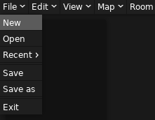
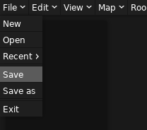
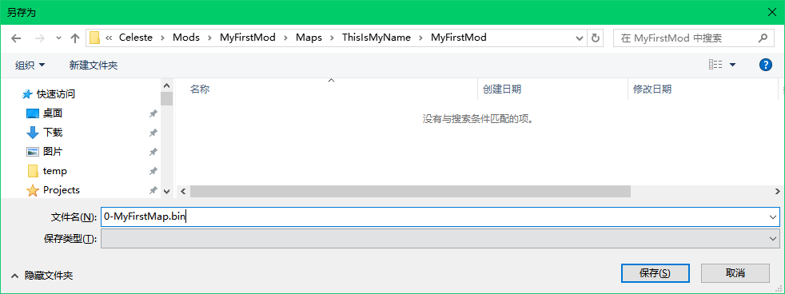

# Mod 结构

`Everest` 支持加载三种格式的 Mod：

1. 零散的 `.bin` 文件（也就是蔚蓝地图文件的格式）作为单独的地图
2. 文件夹形式的 Mod
3. 压缩包形式的 Mod，压缩包内的结构与文件夹形式的 Mod 相同

一般已经发布的 Mod 会使用第三种格式，而第二种格式一般用在 Mod 制作时。虽然第一种格式也被支持，但是这里并不推荐。

## Mod 文件夹的结构

一般地，一个包含可游玩地图的 Mod 有这样的结构：

- 📁 `Dialog`：包含游戏中出现的不同语言的文本
- 📁 `Graphics`：存放游戏中与画面相关的资源
- 📁 `Maps`：存放地图文件
- 📄 `everest.yaml`：`Everest` 用来识别你的 Mod 的“Mod 信息清单”

其中只有 `everest.yaml` 是必须的，其他部分都是可选的。  

现在我们在游戏的 `Mods` 文件夹中新建一个文件夹，并命名为 `MyFirstMod`，然后新建必须的文件 `everest.yaml`。

!!! note "文件后缀名"
    Windows 默认不显示文件的后缀名，你需要手动启用它：  
      
    请确保你的文件名是 `everest.yaml`，而不是 `everest.yaml.txt`。在更改了后缀名时 Windows 应该会有如下弹窗警告你：  
      
    我们清楚我们正在做什么，所以我们选择 `是(Y)`。

### `everest.yaml` 文件

这是一个 `yaml` 格式的文件，不过在这里你并不需要掌握 `yaml` 格式，对于一个普通的 Mod 来说，你只需要用任何文本编辑器打开并写下如下行内容，其余内容 Loenn 会自动帮你填写：

```yaml title="everest.yaml"
- Name: MyFirstMod
  Version: 0.1.0
  Dependencies:
    - Name: Everest
      Version: 1.5617.0
```

!!! note "注意"
    `yaml` 格式对空格非常敏感，这里建议直接复制上面的内容并更改需要的地方。不过后面为了让我们的 Mod 更加多彩，通常会接触到更多 `YAML` 以及 `XML` ，为了让这些文件更容易编辑，我会推荐使用 [`VS Code`](https://code.visualstudio.com) 作为编辑器并安装上 [`YAML`](https://marketplace.visualstudio.com/items?itemName=redhat.vscode-yaml) 和 [`XML`](https://marketplace.visualstudio.com/items?itemName=redhat.vscode-xml) 插件。

在如上文件中，第一行写明了你 Mod 的名字，或者更准确一点，`ID`。这并不是你 Mod 显示的名字，而是一个唯一的标识符，它用于 `Everest` 内部加载标识你的 Mod，也用于 Mod 的更新检测，两个相同 `ID` 的 Mod 会被视为同一个 Mod。所以确保你的 `ID` 是唯一的。这里建议只使用大小写英文字母以及下划线和空格，尽量不要使用其它字符。  
第二行 `Version` 后面写明了你 Mod 的版本，每当你需要为你的地图做出更新时，你需要更新这一项，以区别于该 Mod 的其他版本，更新检测时就会用到这一项来判断哪个版本是最新的。版本的格式是 `x.y.z`，其中 `x` 表示主版本，`y` 表示次版本，`z` 表示补丁版本。一般来说，`x` 的更改见于你的 Mod 发生了非常大的更新，例如，用 `0` 表示该 Mod 还是一个未完工版本，用 `1` 表示该 Mod 已经完成了主干部分，随后每当该 Mod 迎来例如新增或重做了若干章节等大更新， `x` 就会 +1。`y` 的增加适用于一些一般的更新，例如某一张图中新增了若干草莓，若干彩蛋面，或者重做了一部分面等。`z`一般用于小规模更新，例如修复了某些可以偷鸡的地方，改善了部分装饰或者微调物体等。不过这些并不是强制的，只需要它能传达出你想表达的意思即可。  
之后只有一个第五行要注意，它写明了该 Mod 依赖的 `Everest` 的版本，格式为 `1.v.0`，其中 `v` 为 `Everest` 的版本号。为了确保你的 Mod 出现最少的问题，建议将这个值设置为你制作 Mod 时用到的 `Everest` 版本（一般不建议使用非 `stable` 版本的 `Everest` 制作 Mod）。

### `Maps` 文件夹

现在我们可以创建一个 `Maps` 文件夹用来存放我们的地图了：

- 📁 `Maps`
    - 📁 YourName
        - 📁 ModName

~~是的这的确是在套娃，~~`Everest` 加载 Mod 时大概可以认为只是在合并所有文件夹，所以在公共的 `Maps` 文件夹下我们应尽量创建尽可能唯一的到你的地图文件的路径，最常见的做法就是在顶级文件夹 `Maps` 下新建以你的名字命名的文件夹，然后再在里面新建一个以 Mod 名字命名的文件夹（这里使用你之前在 `everest.yaml` 中写的 Mod 名字最好），最后就到了我们自由发挥的地方了。我们会在后续多次使用到这两个名字，所以请务必记住它们。  
在这里以及后续部分，我会采用 `ThisIsMyName` 作为名字，`MyFirstMod` 作为 Mod 名字。

### `.bin` 文件

在新建好 `Maps` 中层层的文件夹后，我们就可以创建地图了，在 Loenn 里创建一个地图只需要按下 ++ctrl+n++，或者在菜单中选择 `File -> New`。然后按下 ++ctrl+s++ 来保存它，或者在菜单中选择 `File -> Save` 来保存它。  


  



!!! note "文件名字"
    你可能注意到了我们在前面加了一个 `0-` 的前缀，这是用来手动指定顺序的，默认 Everest 会按照文件名来排序你的地图，每一个地图文件都会被解析为一个游戏中的章节，如果你要制作一个多章节的 Mod，那么你需要这样才能指定这些章节的解锁顺序。

----

到此，你就可以在游戏中查看到地图的存在了，不过我们还不能进去，因为我们的地图没有任何一面，这时进去 Everest 只会报一个错。  
