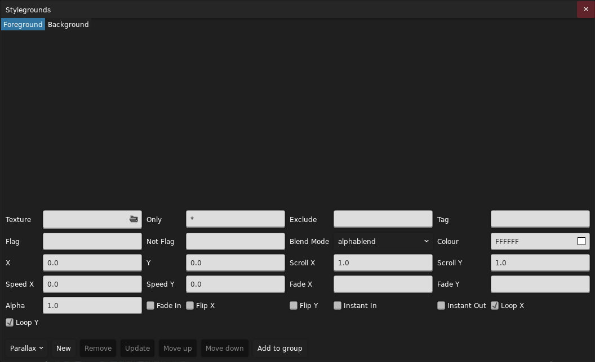
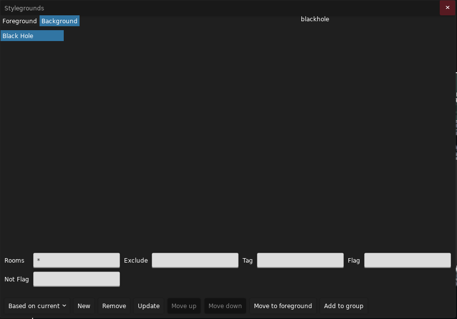
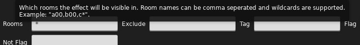
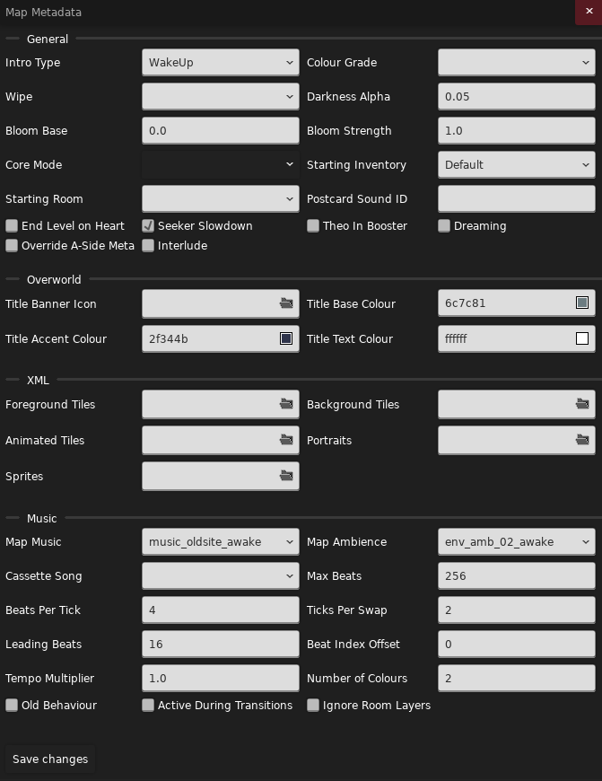
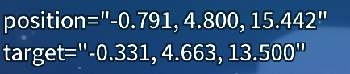
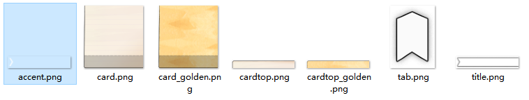
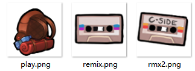

# 房间属性，元数据，文本

## 更多房间属性

在前面我们只指明了房间的名称，当然，还有很多其他的属性：

  

按照顺序它们分别是：

- `Room Name`：房间名称
- `Colour`：在游戏内 F6 地图中显示的颜色
- `X`：房间横坐标（单位 tile）
- `Y`：房间纵坐标（单位 tile）
- `Width`：房间宽度
- `Height`：房间高度
- `Camera Offset X`：房间默认的镜头横坐标偏移（单位 tile）
- `Camera Offset Y`：房间默认的镜头纵坐标偏移（单位 tile）
- `Wind Pattern`：房间起始刮风的类型
- `Underwater`：整个房间是否都在水下
- `Space`：房间是否具有 8AB 结尾的低重力和上下贯通效果
- `Disable Down Transition`：是否禁用向下切板（掉下去直接死即使有房间接邻），在官图 7AB 中大量用到
- `Checkpoint`：房间是否是一个记录点，也就是作为地图新的一节的第一面
- `Dark`：是否降低房间亮度，与 5A 变黑效果相同
- `Whisper`：背景是否有人声倒放（5A的效果）
- `Music Layer X`：是否启用第 X 层的音乐
- `Music`：音乐 ID
- `Music Progress`：音乐的进度
- `Ambience`：环境音
- `Ambience Progress`：环境音的进度

其中关于音乐的部分会在后面说到。  

!!! info "对于风的类型有这些："
    - `Left`：左风（`400px/s`）
    - `Right`：右风（`400px/s`）
    - `LeftStrong`：左强风（`800px/s`）
    - `RightStrong`：右强风（`800px/s`）
    - `LeftOnOff`：左间歇风（`800px/s`，`3s`）
    - `RightOnOff`：右间歇风（`800px/s`，`3s`）
    - `LeftOnOffFast`：左快速间歇风（`800px/s`，`2s`）
    - `RightOnOffFast`：右快速间歇风（`800px/s`，`2s`）
    - `Alternating`：左右交替间歇风（`400px/s`，`3s 风 2s 停`）
    - `LeftGemsOnly`：仅在玩家携带草莓籽时挂左风（`400px/s`）
    - `RightCrazy`：右极强风，出现于官图 4C 第三面（`1200px/s`）
    - `Down`：下风（`300px/s`）
    - `Up`：上风（`400px/s`）
    - `Space`：上风，出现于官图 9-9（`600px/s`）

## Stylegrounds

到目前我们的房间背景还是漆黑的一片，到这一节你就可以为背景增添一些色彩了。  

`Stylegrounds` 是属于每个房间的，不过大概是因为大部分房间共享同一组 `Stylegrounds`，实际上我们需要在地图的属性中去编辑它。在 Loenn 中它在 `Map->Stylegrounds` 中。  

  

不要被一上来的一大堆属性吓到了，实际上中间这一堆属性是 Loenn 默认选中的 `Parallax` 的属性，为了简单起见，你可以在左下角的下拉框中选择 `Black Hole`，就如字面意思，它是官图 9A 中背景的黑洞。这时点击右边的 `New` 按钮即可添加进去，不过在此之前你需要注意一下左上角的 `Foreground` 和 `Background` 的选择，由于黑洞这个 `Styleground` 是完全不透明且是一个背景，那么我们需要选择 `Background`，然后再点击 `New`，这时候属性列表就简单一些了：  

  

对于黑洞这个 `Styleground` 来说，有如下属性：

- `Rooms`：要显示黑洞的房间名，支持通配符（`*` 匹配任何字符），用逗号分隔（注意别用中文逗号，将输入法切换到英文模式再输入），例如 `a_00,a_01,a_alt,b_*`，它除了会在前面声明的三个 `a_` 房间显示外，在任何名字以 `b_` 开头的房间也会显示，这就是为什么会推荐这种房间命名格式。
- `Exclude`：要取消显示的房间名，与 `Rooms` 格式相同，当 `Rooms` 里被指定了的房间名，例如上面可能会出现的 `b_alt`，你可能不希望对这个房间显示黑洞，你就需要在这里写一条 `b_alt`。
- `Tag`：标记，主要用于在代码中引用这个 `Styleground`。
- `Flag`：除了设置房间名以显示隐藏 `Styleground` 外，还能通过 `Flag` 控制，仅在 `Flag` 开启时显示。
- `Not Flag`：当 `Not Flag` 开启时隐藏。

!!! info "Flag"
    `Flag` 是一种“开关”，我们将在下一章介绍它。

!!! info "悬浮提示"
    在 Loenn 中如果你看属性名字看不懂字面意思时，你可以将鼠标悬浮在属性名字上，有些时候它会显示一条更详细的说明，例如上述的 `Rooms`：  
      
    > 决定哪些房间这个特效会显示。房间名字用逗号分隔，并且支持通配符。比如：“`a00,b00,c*”。

当添加了一个 `Styleground` 后，左边的列表就新增了一项，游戏会按照它们排列的顺序依次绘制，也就是说在列表最上方的在最底层，在列表最下方的在最顶层。在 Loenn 中选中一项后可以点击右边的 `Move Up` 和 `Move Down` 进行上下移动。顺便，更新 `Styleground` 的属性和更新物体的属性一样也要手动点击 `Update` 进行更新。  
除此之外还有一小部分 `Styleground` 有 `Colour` 属性，顾名思义它指明了颜色。再然后就是一个常用且万能的 `Parallax`，它常见地被用来创建背景以及视差背景，它的参数很多：  

  

- `Texture`：要显示的贴图路径
- `Only`：和上述的 `Rooms` 属性一样，表示要显示的房间
- `Exclude`，`Tag`，`Flag`，`Not Flag`：均和 `Black Hole` 一致
- `Blend Mode`：混合模式，即该 `Parallax` 如果是透明的话如何与现有画面混合，默认为 `alphablend`，也就是比较符合直觉的混合方式。`additive` 加法混合模式，通常用于将光，火焰等透明发光贴图混合，最终的画面通常看上去会“变亮”
- `Colour`：对该 `Parallax` 的贴图进行调色
- `X`，`Y`：贴图的相对偏移，单位 `px`
- `Scroll X`，`Scroll Y`：镜头移动时贴图的偏移幅度，单位 `px`，当为 `1` 时，背景会跟随镜头一起移动，就像玩家和贴图在同一图层一样。当值小于 `1` 时，视觉上会感觉贴图在更远一些的地方，数值越小越远，为 `0` 则不会随镜头而移动。当为负数时移动方向反向，当大于 `1` 时，hm，&#8203;~~会很晕，不想被玩家打的话别试~~
- `Speed X`，`Speed Y`：背景自然移动的速度，单位 `px/s`。例如用于云类型背景的自然飘动。
- `Fade X`，`Fade Y`：贴图随镜头中心位置的不透明度渐变。例如 `n500-500,0-1`，表示**全局坐标系**中当镜头从 `-500` 到 `500` 时不透明度从 `0` 渐变到 `1`，因为 `-` 符号被占用表示范围，所以使用字母 `n` 表示负号。可以使用 `:` 分隔指定多个范围：`0-400,0-0.3:400-800,0.3-0`，当多个范围有重叠时，最终不同范围的结果将相乘得到最终的不透明度。
- `Flip X`，`Flip Y`：是否横向/纵向翻转贴图
- `Fade In`：当切面过来时是否要渐变
- `Instant In`：是否切面途中就要进行渐变而不是切完面后再渐变
- `Instant Out`：是否切面出去途中就直接隐藏
- `Loop X`，`Loop Y`：是否要循环平铺贴图

~~`Parallax` 确实没有 `Fade Out` 这个属性，我没写漏你也没看漏，或许官图认为一般要隐藏一个背景时就要显示另一个背景所以不需要一个 `Fade Out` 吧~~  

对于固定在背景的一张图，一般会设置 `Loop` 全关掉，`Scroll` 也全设置为 `0`，这样这张图就被“钉”在背景上了。对于为了创造视差的背景，一般会保持 `Loop` 打开，`Scroll` 根据想要造成视差的程度来调整，越远越小。  

好的那么说了这么多你会发现……“贴图路径”是什么，它怎么填你还不知道。这时就要用到 `Graphics` 文件夹了，不过在此之前你可以拿几个官图就有的贴图来尝试一下上面的属性的效果：

- `bgs/04/bg0`：4A 的云背景（横向循环）
- `bgs/01/bg0`，`bgs/01/bg1`，`bgs/01/bg2`：1A 的城市背景（静态）
- `bgs/10/granny/bg`：9A 结尾见奶奶时的背景（静态）
- `bgs/03/bg0`，`bgs/03/bg1`：3A 开头形成视差的两簇云

那么现在是同样的 `Graphics` 文件夹套娃：

- 📁 `Graphics`
    - 📁 `Atlases`
        - 📁 `Gameplay`
            - 📁 `bgs`
                - 📁 `MyFirstMod`
                    - 📄 `awesome_bg.png`
                    - 📄 `another_cool_bg.png`
                    - 📄 `awesome_bg_2.png`

然后你就可以使用 `bgs/MyFirstMod/awesome_bg` 来作为路径引用你的贴图了。注意图片格式必须为 `.png` 格式且有 `.png` 后缀。

!!! warning "`.png` 格式"
    请**不要**将一张 `.jpg` 或其它格式的图片**仅通过**改后缀名的形式让它“转换”为另一种格式，虽然它依然能打开但这是图片查看器的功劳而**不是**你的。你需要使用任何图片编辑器或者查看器打开你的其它格式的图片，然后在菜单中寻找“另存为...”并在格式选择的下拉框中选择 `.png` 然后保存，这样你才得到了一个真正的 `.png` 图片。  
      
    

!!! info "路径分隔符"
    虽然 `Everest` 在某些地方会支持使用 `\` 作为路径分隔符，但是以防万一我们建议**只**使用 `/` 作为路径分隔符。

## 地图元数据

### 文件内元数据

地图有两种元数据，一种写在地图文件里面，一种写在地图文件外面，这里我们先看看地图文件里面的元数据有些什么，这部分内容可以在 Loenn 菜单 `Map->Metadata` 中找到：

  

可以看到它们被分为了四栏：

- `General`：通用的属性
- `Overworld`：选章界面的属性
- `XML`：XML 相关属性
- `Music`：音乐相关属性

`General` 中的属性比较杂：

- `Intro Type`：进入地图的动画类型
    - `Respawn`：使用重生动画
    - `WalkInRight`：从地图右侧同一高度走到重生点
    - `WalkInLeft`：从地图左侧同一高度走到重生点
    - `Jump`：跳跃进入（1A）
    - `WakeUp`：醒来（2A）
    - `Fall`：从出生点一直往下掉落，直到碰到水（6A）
    - `TempleMirrorVoid`：5A 从镜中世界虚空中醒来，需要使用代码辅助。&#8203;~~否则玛德琳就无法醒过来了~~
    - `ThinkForABit`：9A 开头的动画
    - `None`：无动画
- `Colour Grade`：要使用的色阶图，这会在后面提到
- `Wipe`：重生及复活时用到的黑屏动画
    - `Angled`：1ABC 中使用
    - `Curtain`：序章和尾声中使用
    - `Dream`：2ABC 中使用
    - `Drop`：5ABC 中使用
    - `Fade`：渐变，官图中用于其它地方
    - `Fall`：6ABC 中使用
    - `Heart`：8ABC 中使用
    - `KeyDoor`：3ABC 中使用
    - `Mountain`：7ABC 中使用
    - `Spotlight`：聚光灯，官图中用于其它地方
    - `Starfield`：9A 中使用
    - `Wind`：4ABC 中使用
- `Darkness Alpha`：黑暗程度（`0~1`），越大地图越黑，`Styleground` 不受影响
- `Bloom Base`：地图泛光强度基值，具体会在后面提到
- `Bloom Strength`：地图泛光强度，具体会在后面提到
- `Core Mode`：默认的核心模式，即 8ABC 的冰或火模式
- `Starting Inventory`：初始的“物品栏”，以单冲，启用了果冻，有背包，落地恢复冲刺为基准，有：
    - `Prologue`：序章，无冲，不启用果冻
    - `Default`：默认
    - `OldSite`：2A，不启用果冻
    - `CH6End`：6A 结尾，双冲
    - `TheSummit`：7ABC，双冲，无背包
    - `Core`：8ABC，双冲，不恢复冲刺
    - `Farewell`：9A，无背包
- `Starting Room`：起始房间
- `Postcard Sound ID`：明信片音效 ID，这会在后面的音乐章节提到
- `End Level on Hear`：是否在吃心后结束关卡
- `Seeker Slowdown`：是否启用新浪靠近玩家时的一系列效果（该属性的名字和 Loenn 对其效果的描述均不够完全）
- `Theo In Booster`：是否允许玩家在泡泡内时依然持有抓取物（Theo 水晶，水母等）
- `Dreaming`：影响 `Stars` 这个 `Styleground` 的效果
- `Override A-Side Meta`：是否覆盖 A 面的元数据（见下面有关 ABC 面的说明）
- `Interlude`：是否这章只是一个“过场”，例如官图的序幕和尾声

`Overworld` 中的属性在这里基本是设置选章时的一些颜色和图标：  

  

其中地图图标你需要放置在 `Graphics/Atlases/Gui/areas/ThisIsMyName/MyFirstMod` 中，文件名字任意比如说 `chap1.png`，此外还要有个图标的背面 `chap1_back.png`，然后在元数据中写上 `areas/ThisIsMyName/MyFirstMod/chap1` 作为路径。地图图标大小必须为 `180x180px`。  
这些是官图用到的 `Title Base Colour` 和 `Title Accent Colour`：

```yaml title="官图的颜色信息"
序章/尾声: 383838, 50afae
被遗弃的城市: 6c7c81, 2f344b
旧址: 247f35, e4ef69
天空度假山庄: b93c27, ffdd42
黄金山脊: ff7f83, 6d54b7 
镜之寺庙: 8314bc, df72f9
沉思: 359fe0, 3c5cbc
山顶: ffd819, 197db7
核心: 761008, e0201d
再见: 240d7c, ff6aa9 
```

接下来是 `XML`，不过这会在后面章节拆成三部分来说。`Music` 部分依然是到音乐相关的章节。

### 文件外元数据

文件内的元数据是相对比较少的，又由于游戏本体很多元数据实际上硬编码在代码里，所以 `Everest` 为我们提供了一个外部的文件 `.meta.yaml` 来声明元数据：

- 📄 `0-MyFirstMap.bin`
- 📄 `0-MyFirstMap.meta.yaml`

这个文件的一个例子：

!!! info "很长一串 yaml"
    ```yaml title="0-MyFirstMap.meta.yaml"
    Mountain:
        ShowSnow: false

        FogColors:
            - 039668
            - 039645

        StarFogColor: ffffff
        StarStreamColors:
            - ffffff
            - ffffff
            - ffffff
        StarBeltColors1:
            - ffffff
            - ffffff
        StarBeltColors2:
            - ffffff
            - ffffff

        MountainModelDirectory: "Mountain/ThisIsMyName/MyFirstMap"
        MountainTextureDirectory: "ThisIsMyName/MyFirstMap"

        Idle:
            Position: [ -1.374, 1.224, 7.971 ]
            Target: [ -0.440, 0.499, 6.358 ]
        Select:
            Position: [ -1.390, 0.784, 7.593 ]
            Target: [ -0.052, 0.545, 6.125 ]
        Zoom:
            Position: [ -1.104, 0.661, 7.292 ]
            Target: [ -0.324, 0.565, 5.452 ]
        Cursor: [ -0.880595, 0.8781773, 6.77277 ]

        State: 0
        Rotate: true
        ShowCore: false
        BackgroundMusic: "event:/some_great_music/here"
        BackgroundAmbience: "event:/some_great_ambience/here"
        MarkerTexture: "marker/ThisIsMyName/MyFirstMod/anAwesomeMarker"

    LoadingVignetteText:
        Dialog: "ThisIsMyName_MyFirstMod_Vignette"

    LoadingVignetteScreen:
        Atlas: "VignetteScreens/ThisIsMyName/MyFirstMod"
        Start: [ 0.0, 0.0 ]
        Center: [ 0.0, 0.0 ]
        Offset: [ 0.0, 0.0 ]
        Title:
            ASide: "ThisIsMyName_MyFirstMod_ASide_Complete"
            BSide: "ThisIsMyName_MyFirstMod_BSide_Complete"
            CSide: "ThisIsMyName_MyFirstMod_CSide_Complete"
            FullClear: "ThisIsMyName_MyFirstMod_ASide_FullClear"
        Layers:
            - Type: "layer"
            Images: [ "MyFirstMap" ]
            Position: [ 0.0, 0.0 ]
            Scroll: [ 0.0 ]

    CompleteScreen:
        Atlas: "Endscreens/ThisIsMyName/MyFirstMod"
        Start: [ 0.0, 0.0 ]
        Center: [ 0.0, 0.0 ]
        Offset: [ 0.0, 0.0 ]
        Title:
            ASide: "ThisIsMyName_MyFirstMod_ASide_Complete"
            BSide: "ThisIsMyName_MyFirstMod_BSide_Complete"
            CSide: "ThisIsMyName_MyFirstMod_CSide_Complete"
            FullClear: "ThisIsMyName_MyFirstMod_ASide_FullClear"
        Layers:
            - Type: "layer"
            Images: [ "chap1" ]
            Position: [ 0.0, 0.0 ]
            Scroll: [ 0.0 ]
    ```

确实，这个文件很长，不过上面所有内容都是可选的，在这里我们暂时只看看大多数 Mod 改了的地方，后续会进行补充：

这里只会看看 `Mountain` 下面的属性，也就是与选章界面的背景的 3D 山有关的东西：

<!--- RIP, 原本打算全写了, 但是还是只提取一部分罢

- `ShowSnow`：是否正在下雪
- `FogColors`：雾的颜色，不限数量
- `StarFogColor`：星空中雾的颜色，不限数量
- `StarStreamColors`：星河的颜色，不限数量
- `StarBeltColors1`，`StarBeltColors2`：星带，就是那一堆星星的颜色，不限数量
- `MountainModelDirectory`：自定义山体模型的路径，从 Mod 的最顶级目录开始
- `MountainTextureDirectory`：自定义山体模型中用到的贴图所在目录，从 `Graphics/Atlases/Mountain` 开始
- `Idle`，`Select`，`Zoom`：分别是未选择，选择（打开了 ABC 面选择或小节选择），进入时的镜头的位置（`Position`）和所看向的目标位置（`Target`），两个位置不能相同否则会报错
- `Cursor`：玛德琳小人标记的位置
- `State`：山体的状态，`0` 为夜晚，`1` 为白天，`2` 为黄昏，`3` 为月球
- `Rotate`：镜头是否要绕着山转
- `ShowCore`：山的核心是否打开
- `BackgroundMusic`：选章界面的背景音乐
- `BackgroundAmbience`：选章界面的环境音
- `MarkerTexture`：玛德琳小人标记的贴图动画

> ~~哦我的老天啊这东西怎么这么长~~

-->

- `ShowSnow`：是否正在下雪
- `Idle`，`Select`，`Zoom`：分别是未选择，选择（打开了 ABC 面选择或小节选择），进入时的镜头的位置（`Position`）和所看向的目标位置（`Target`），两个位置不能相同否则会报错
- `Cursor`：玛德琳小人标记的位置
- `State`：山体的状态，`0` 为夜晚，`1` 为白天，`2` 为黄昏，`3` 为月球
- `Rotate`：镜头是否要绕着山转
- `ShowCore`：山的核心是否打开
- `BackgroundMusic`：选章界面的背景音乐
- `BackgroundAmbience`：选章界面的环境音

对于镜头的位置，在 `Everest` 调试模式中可以按下默认 ++space++ 键进行自由移动，然后移动到合适的位置就可以抄写左上角的信息了：

  

如果只需要自定义上述内容，大可直接删掉上面那一个文件的大多数地方：

```yaml title="0-MyFirstMap.meta.yaml"
Mountain:
    ShowSnow: false
    Idle:
        Position: [ -1.374, 1.224, 7.971 ]
        Target: [ -0.440, 0.499, 6.358 ]
    Select:
        Position: [ -1.390, 0.784, 7.593 ]
        Target: [ -0.052, 0.545, 6.125 ]
    Zoom:
        Position: [ -1.104, 0.661, 7.292 ]
        Target: [ -0.324, 0.565, 5.452 ]
    Cursor: [ -0.880595, 0.8781773, 6.77277 ]

    State: 0
    Rotate: true
    ShowCore: false
```

### B，C 面

向你的图加入 B，C 面很简单，只需要新建一个名字以 `-B` 或 `-C` 的 `.bin` 文件就行了：

- 📁 `MyFirstMod`
    - 📄 `0-MyFirstMap.bin`
    - 📄 `0-MyFirstMap-B.bin`
    - 📄 `0-MyFirstMap.meta.yaml`
    - 📄 `1-MySecondMap.bin`

不过这里需要注意的是，ABC 面共享元数据以及 `meta` 文件，如果你需要不同的地图内元数据你需要在 B，C 面地图中勾选之前提到的 `Override A-Side Meta`。

### 其它地图自定义

横幅，卡片，围巾，攀爬按钮的贴图也能够自定义，例如你有如下这几个地图：

- 📁 `MyFirstMod`
    - 📄 `0-MyFirstMap.bin`
    - 📄 `1-MySecondMap.bin`
    - 📄 `2-MyThirdMap.bin`

能够自定义的贴图有：  
横幅（`title.png` `accent.png`），攀爬按钮（`tab.png`），卡片（`card.png` `cardtop.png` `card_golden.png` `cardtop_golden`）：  
  
攀爬按钮图标（`play.png` `remix.png` `rmx2.png`）：  
  
围巾（`hover.png`）：  
  

在制作好这些贴图后，命名成同上的名字，然后放置在这些地方：

- 📁 `Graphics`
    - 📁 `Atlases`
        - 📁 `Gui`
            - 📁 `areaselect`
                - 📁 `MyFirstMod`
                    - 📄 `title.png`
                    - 📄 `accent.png`
                    - 📄 `card.png`
                    - 📄 `card_golden.png`
                    - 📄 `cardtop.png`
                    - 📄 `cardtop_golden.png`
                    - 📄 `tab.png`
            - 📁 `areas`
                - 📁 `MyFirstMod`
                    - 📄 `hover.png`
            - 📁 `menu`
                - 📁 `MyFirstMod`
                    - 📄 `play.png`
                    - 📄 `remix.png`
                    - 📄 `rmx2.png`

这样会对 `MyFirstMod` 下的所有地图生效，如果要只针对一个地图生效，只需要在文件名前加上地图文件名和一个下划线，例如：

- 📁 `Graphics`
    - 📁 `Atlases`
        - 📁 `Gui`
            - 📁 `areaselect`
                - 📁 `MyFirstMod`
                    - 📄 `0-MyFirstMap_title.png`
                    - 📄 `0-MyFirstMap_accent.png`
                    - 📄 `1-MySecondMap_card.png`
                    - 📄 `1-MySecondMap_card_golden.png`
                    - 📄 `1-MySecondMap_cardtop.png`
                    - 📄 `1-MySecondMap_cardtop_golden.png`
                    - 📄 `tab.png`
            - 📁 `areas`
                - 📁 `MyFirstMod`
                    - 📄 `hover.png`
            - 📁 `menu`
                - 📁 `MyFirstMod`
                    - 📄 `2-MyThirdMap_play.png`
                    - 📄 `2-MyThirdMap_remix.png`
                    - 📄 `2-MyThirdMap_rmx2.png`

## 文本

当目前为止我们的 Mod 名字和地图名还是一大长串像路径一样的东西，在这一节我们就能够自定义它们了。  
首先你需要创建两个文件到 `Dialog` 文件夹下：

- 📁 `Dialog`
    - 📄 `English.txt`
    - 📄 `Simplified Chinese.txt`

然后写下如下内容：

<!---- 这不是 ini 但是高亮还挺不错，不是么 -->
```ini title="English.txt"
ThisIsMyName_MyFirstMod= Name of my first mod's maps!
ThisIsMyName_MyFirstMod_0_MyFirstMap= Hi here's the chapter1!
```

```ini title="Simplified Chinese.txt"
ThisIsMyName_MyFirstMod= 我的 Mod 地图集名称！
ThisIsMyName_MyFirstMod_0_MyFirstMap= 你好这里是第一章！
```

添加了新的 Dialog 后记得重启游戏，然后你就能看到先前的奇怪路径  

  

变成了正常的文字：  

  

然后你可能就会遇到这个问题：  

```ini title="Simplified Chinese.txt"
ThisIsMyName_MyFirstMod= 一个蔚蓝的地图集
ThisIsMyName_MyFirstMod_0_MyFirstMap= 一张蔚蓝地图的名字
```


蔚蓝中的“蔚蓝”消失了！这是正常的，蔚蓝只能渲染哪些本体就已经有的文字，对于之外的文字就会出现缺字库的问题，你可以前往 [Maddie 的字库生成网站](https://maddie480.ovh/celeste/font-generator) 选择中文，然后上传你的 `Dialog` 文件，也就是 `Chinese Simplified.txt`，你会得到一份包含了字库的压缩包，然后你需要将压缩包的文件解压到 `Dialog/Fonts` 目录下。当然，在制图过程中反复生成字库并不是一件愉快的事，所以一般我们会在制图时打开 [Extended Chinese Font](https://gamebanana.com/mods/53736) 这个 Mod，它包含了一个较大的比较全面的字库，不过一般你不需要单独下这个 Mod，因为群服 Mod 就依赖这个 Mod，也有一部分 Mod 在发布时没有自己生成字库直接依赖了这个 Mod。  

> ~~是的蔚蓝里没有 `蔚蓝` 两个字，这很合理~~

### `Dialog` 文件

上述提到的文件叫 `Dialog` 文件，用于存放不同语言的文本，它的格式很简单：

```ini
键名= 键值
键名2= 键值2
其他键名= 其他键值...
```

一个键名等于一个键值。不过比较难受的一点是键名和等号之间不能有空格，否则会解析出现问题。键名建议只使用大小写字母，下划线和数字，避免出现一些可能的问题，此外键名在使用和被使用时对大小写不敏感，个人就建议用自己最舒服的大小写组合了。而键值相对宽松一点，除了比较自由的空白字符外还允许换行：

```
键名=
    键
    值能换
    行还
    算比
    较方便
键名a=写到一半允许
    突然
换
            行
```

在解析每一行时蔚蓝会丢弃掉左右出现的空白字符，所以不必担心有空白字符混进去，不过换行符依然会最终包括在解析结果内。

### 生成的键名

在 `Everest` 中会自动为一些需要出现文本的地方生成键名，例如我们刚刚写下的指定地图集名字和章节名的两行 `Dialog`：

```ini title="Simplified Chinese.txt"
ThisIsMyName_MyFirstMod= 我的 Mod 地图集名称！
ThisIsMyName_MyFirstMod_0_MyFirstMap= 你好这里是第一章！
```

`Everest` 会参照文件夹路径生成一个键名，但是会将所有空白字符 ` `，连字符 `-`，斜杠 `/`，加号 `+` 全部转换为下滑线 `_`，就如上面的 `ThisIsMyName/MyFirstMod/0-MyFirstMap.bin` 就被转换为了 `ThisIsMyName_MyFirstMod_0_MyFirstMap`。  

除此之外还有小节名 `ThisIsMyName_MyFirstMod_0_MyFirstMap_<作为记录点房间的名字>`：

```ini
ThisIsMyName_MyFirstMod_0_MyFirstMap_A_start= 第 一 节
ThisIsMyName_MyFirstMod_0_MyFirstMap_b_01= 第 二 节
```

如果你的图是 A 面，可以用 `A_start` 代替房间名表示第一小节的名字，否则默认是“开始”，B 面则是 `B_start`。  

吃心后的结束语，加上 `poem_` 的前缀以及对应 AB 面名字的后缀 `_A` `_B`：

```ini
poem_ThisIsMyName_MyFirstMod_0_MyFirstMap_A= 恭喜通过本地图！ A
poem_ThisIsMyName_MyFirstMod_0_MyFirstMap_B= 恭喜通过本地图！ B
```

进图之前显示的明信片，加上 `_postcard` 的后缀，如果是 B C 面的话还要再在之前加上 `_b` `_c` 的后缀：

```ini
ThisIsMyName_MyFirstMod_0_MyFirstMap_postcard= 本地图非常散步，请放心游玩！（逃）
ThisIsMyName_MyFirstMod_0_MyFirstMap_b_postcard= 本地图 B 面也非常散步，请放心游玩！（逃）
ThisIsMyName_MyFirstMod_0_MyFirstMap_c_postcard= 本地图 C 面还是非常散步，请放心游玩！（逃）
```

B 面显示混音以及混音作者的文字，加上 `_remix` 和 `_remix_artist` 的后缀：

```ini
ThisIsMyName_MyFirstMod_0_MyFirstMap_remix= 超好听混音
ThisIsMyName_MyFirstMod_0_MyFirstMap_remix_artist= 不知名作者
```

----

此外明信片中的文字支持调整颜色，加入飘动特效等效果，这会在下一章剧情中提到。